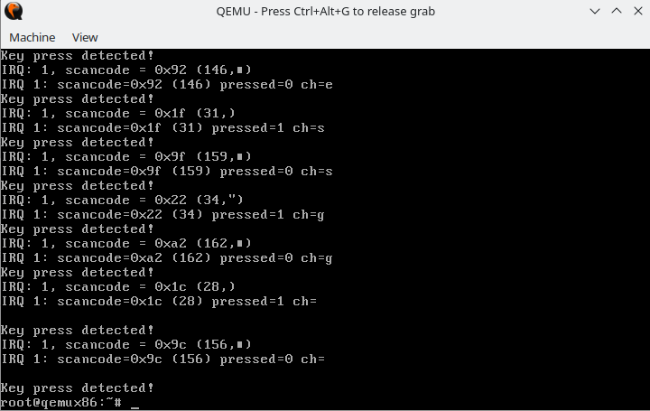
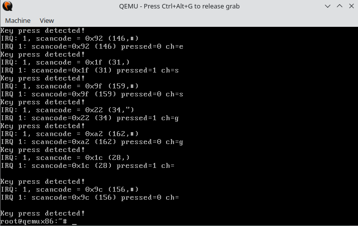
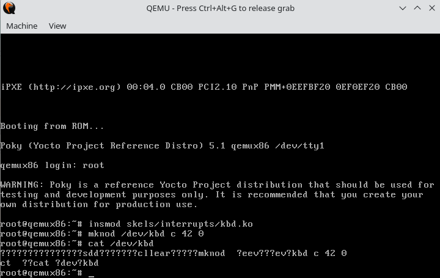

# 0. Intro
Using LXR, find the definitions of the following symbols in the Linux kernel:
- `struct resource`
    - Defined in `linux/ioport.h`
- `request_region()` and `__request_region()`
    - `request_region()` is a macro defined in `linux/ioport.h`
    - `__request_region()` is a function defined in `kernel/resource.c`; used to create a new busy resource region.
- `request_irq()` and `request_threaded_irq()`
    - `request_irq()` is defined in `linux/interrupt.h`; used to add a handler for an interrupt line.
    - `request_threaded_irq()` is defined in `kernel/irq/manage.c`; used for allocating an interrupt line.
        - **NOTE:** According to the documentation, from the point a call to this function is made, the handler function may be invoked. Because the handler function *must clear any interrupt the board raises,* you *must* take care both to initialize your hardware and to set up the interrupt handler in the right order.
        - **NOTE:** `dev_id` must be globally unique; thus, use the address of the device data structure. Since the handler receives this value it makes sense to use it as well.
- `inb()` for the x86 architecture.
    - Defined in `arch/x86/boot/boot.h`.
    - Basic port I/O.

Analyze the following Linux code:
- Keyboard initialization function `i8042_setup_kbd()`
    - Defined in `drivers/input/serio/i8042.c`
    - **Step 1:** Create a `struct i8042_port` object representing the port the keyboard is connected to.
    - **Step 2:** Register the interrupt handler function (i.e., `i8042_interrupt`) for interrupt line `I8042_KBD_IRQ` (i.e., line `1`) using `request_irq()`.
    - **Step 3:** Enable the keyboard port.
    - **Step 4:** Mark the global flag `i8042_kbd_irq_registered` to `true`.
    - **Error Handling:**
        - If an error occurs with the `request_irq()` call, then release the port the keyboard is connected to and return an error.
        - If an error occurs with the `i8042_enable_kbd_port()` call, then remove the interrupt handler from the keyboard interrupt line first, and then free the port the keyboard is connected to and return an error.
- The AT or PS/2 keyboard interrupt function `atkbd_interrupt()`
    - Defined in `drivers/input/keyboard/atkbd.c`
    - Interrupt handler that processes data from the keyboard into events.

# 1. Request the I/O Ports
The `kbd.c` file contains a skeleton for the keyboard driver. Browse the source code and inspect `kbd_init()`. Notice that the I/O ports we need are `I8042_STATUS_REG` and `I8042_DATA_REG`.
- Keyboard driver is for a character device with:
    - Major: 42
    - Beginning Minor: 0
    - Number of Minors: 1
- Keyboard hardware information:
    - Interrupt Line: 1
    - Status Register Address: 0x64
    - Data Register Address: 0x60
- A [**scancode**](https://en.wikipedia.org/wiki/Scancode) is the data that most computer keyboards send to a computer to report which keys have been pressed. A number, or sequence of numbers, is assigned to each key on the keyboard.
    - `is_key_press()` checks if the scancode corresponds to a key press or release.
    - `get_ascii()` returns the character of the given scancode (only alphanumeric/space/enter).
- Functions within the driver:
    - `put_char()`: Add a character to buffer in `struct kbd`.
    - `get_char()`: Get a character from the buffer in `struct kbd`.
    - `reset_buffer()`: Resets the buffer in `struct kbd`.
    - `i8042_read_data()`: Return the value of the DATA register on the keyboard.
    - `kbd_open()`: Called when a process opens the keyboard's device file in the file tree.
    - `kbd_release()`: Called when a process releases the keyboard device file resource.
    - `kbd_read():` Returns data stored in the keyboard's buffer.
    - `kbd_init():` Initializes the keyboard driver.
    - `kbd_exit():` Cleans up the keyboard driver upon unloading.

Follow the sections maked with **TODO 1** in the skeleton. Request the I/O ports in `kbd_init()` and make sure to check for errors and to properly clean-up in case of errors. When requesting, set the reserving caller's ID string (`name`) with `MODULE_NAME` macro. Also, add code to release the I/O ports in `kbd_exit()`.
- **TIP:** To request the I/O ports, use `request_region()` where:
    - `first`: Starting port address of the I/O region.
    - `n`: I/O region size in bytes.
    - `name`: Reserving caller's ID string.
- **NOTE:** In the actual i8042 driver code, the `n` parameter for `request_region()` was set to 16.
- **TIP:** To handle errors encountered with `request_region()`, do the following:
    ``` C
    if (!request_region(...)) {
        // Handle error ...
        return -ENODEV;
    }
    ```
- **TIP:** To release the I/O ports, use `release_region()` where:
    - `start`: Starting port address of the I/O region.
    - `n`: I/O region size in bytes.

**Final Console Output:**
```
root@qemux86:~# insmod skels/interrupts/kbd.ko 
Driver kbd loaded
root@qemux86:~# cat /proc/ioports | grep kbd
  0061-0061 : kbd
  0065-0065 : kbd
root@qemux86:~# rmmod skels/interrupts/kbd.ko 
Driver kbd unloaded
root@qemux86:~# cat /proc/ioports | grep kbd
root@qemux86:~#
```

# 2. Interrupt handling routine
First, define an empty interrupt handling routine named `kbd_interrupt_handler()`.
- **NOTE:** Because we already have a keyboard driver that uses this interrupt, we should report this interrupt as *not handled* (i.e., return **IRQ_NONE**) so that the original driver still has a chance to process it.
- **TIP:** Interrupt handlers have the following function pointer signature:
    ```
    irqreturn_t (*irq_handler_t)(int, void *);
    ```
- **TIP:** To register an interrupt handler, use `request_irq`.
- **TIP:** To unregister an interrupt handler, use `free_irq`.

Then register the interrupt handler routine using `request_irq`.
- **TIP:** The interrupt line number we want to register the new interrupt handler to is specified by the `I8042_KBD_IRQ` macro.
- **NOTE:** The interrupt handler must be requested with `IRQF_SHARED` to share the interrupt line with the keyboard driver (i8042).
- **TIP:** For shared interrupts, the `dev_id` parameter cannot be `NULL`. Typically, `dev_id` contains a pointer to the device's data struct; thus, pass `&devs[0]` into `dev_id`.
- **TIP:** To see the interrupt in `/proc/interrupts`, do not use `NULL` for `dev_name`. You can use the `MODULE_NAME` macro instead.

Compile, copy and load module in the kernel. Check that the interrupt line has been registered by looking at /proc/interrupts .
- Result:
    ```
    root@qemux86:~# cat /proc/interrupts
           CPU0       
    0:        129   IO-APIC   2-edge      timer
    1:          9   IO-APIC   1-edge      i8042, kbd
    2:          0    XT-PIC      cascade
    9:          0   IO-APIC   9-fasteoi   acpi
    10:        198   IO-APIC  10-fasteoi   virtio2, virtio5
    11:      12867   IO-APIC  11-fasteoi   virtio3, virtio4, virtio0, virtio1
    12:        125   IO-APIC  12-edge      i8042
    NMI:          0   Non-maskable interrupts
    LOC:      30857   Local timer interrupts
    SPU:          0   Spurious interrupts
    PMI:          0   Performance monitoring interrupts
    IWI:          0   IRQ work interrupts
    RTR:          0   APIC ICR read retries
    RES:          0   Rescheduling interrupts
    CAL:          0   Function call interrupts
    TLB:          0   TLB shootdowns
    ERR:          0
    MIS:          0
    PIN:          0   Posted-interrupt notification event
    NPI:          0   Nested posted-interrupt event
    PIW:          0   Posted-interrupt wakeup event
    root@qemux86:~#
    ```

Print a message inside the routine to make sure it is called. Compile and reload the module into the kernel.
- Result
  ```
  Key press detected!
  Key press detected!
  Key press detected!
  Key press detected!
  Key press detected!
  Key press detected!
  Key press detected!
  Key press detected!
  Key press detected!
  Key press detected!
  Key press detected!
  Key press detected!
  Key press detected!
  Key press detected!
  Key press detected!
  Key press detected!
  root@qemux86:~#
  ```

# 3. Store ASCII keys to buffer
## Reading the Data Register
First, fill in the `i8042_read_data()` function to read the `I8042_DATA_REG` of the keyboard controller. The function just needs to return the value of the register.
- **TIP:** The `i8042_read_data()` function returns a `u8` (or byte). To read a byte from the I/O port, use `inb(u16 port)`.

Call the `i8042_read_data()` in the `kbd_interrupt_handler()` and print the value read. Print information about the keystrokes in the following format:
``` C
pr_info("IRQ:% d, scancode = 0x%x (%u,%c)\n", irq_no, scancode, scancode, scancode);
```
Where scancode is the value of the read register using the `i8042_read_data()` function.
- **Result:**
    ```
    IRQ: 1, scancode = 0x22 (34,")
    Key press detected!
    IRQ: 1, scancode = 0x1c (28,)
    Key press detected!
    root@qemux86:~#
    ```

## Interpreting the scancode
Note that the registry value is a *scancode*, not the ASCII value of the character pressed. Also note that *an interrupt is sent both* when the *key is pressed* and when the *key is released.* **We only need to select the code when the key is pressed and then and decode the ASCII character.**

In the interrupt handler check the scancode to see if the key is pressed or released then determine the corresponding ASCII character.
- **TIP:** To check if the key is pressed or released, use `is_key_press()`.
- **TIP:** To determine the corresponding ASCII character from the scancode, use
`get_ascii()`.
- **Result:**
    

## Store characters to the buffer
Update the interrupt handler to add a pressed ASCII character to the end of the device buffer. If the buffer is full, the character will be discarded.
- **TIP:** The device buffer is the field `buf` in the device's `struct kbd`.
- **TIP:** The device buffer's dimension is located in the `struct kbd` field, called `count`.
- **TIP:** The `put_idx` and `get_idx` fields specify the next writing and reading index, respectively.
- **TIP:** Use `put_char()` to add a character to the device buffer.
- **NOTE:** Synchronize the access to the buffer and the helper indexes with a spinlock. Define the spinlock in the device struct `struct kbd` and initialize it in `kbd_init()`. Use the `spin_lock()` and `spin_unlock()` functions to protect the buffer in the interrupt handler.
- **Result:**
    

# 4. Reading the buffer
For this step follow the sections marked with **TODO 4** in the `kbd_read()` function.

Implement `get_char()` in a similar way to `put_char()`. Be careful when implementing the circular buffer.
- **TIP:** To implement the circular buffer in `get_char()`, ...

In the `kbd_read()` function copy the data from the buffer to the userspace buffer.
- **TIP:** Use `get_char()` to read a character from the buffer and `put_char()` to store it in the user-space buffer.
- **NOTE:** In the read function, use `spin_lock_irqsave()` and `spin_unlock_irqrestore()` for locking. Remember that `spin_lock_irqsave()` disables interrupts upon locking and `spin_unlock_irqrestore()` enables interrupts upon unlocking; we need to do this to prevent an interrupt from creating a deadlock.
- **WARNING:** We cannot use `put_user()` or `copy_to_user()` while holding the lock, as userspace access is not permitted from atomic contexts.

Build, copy and boot the virtual machine and load the module. Test it using the `cat /dev/kbd` command.


# 5. Reset the buffer
